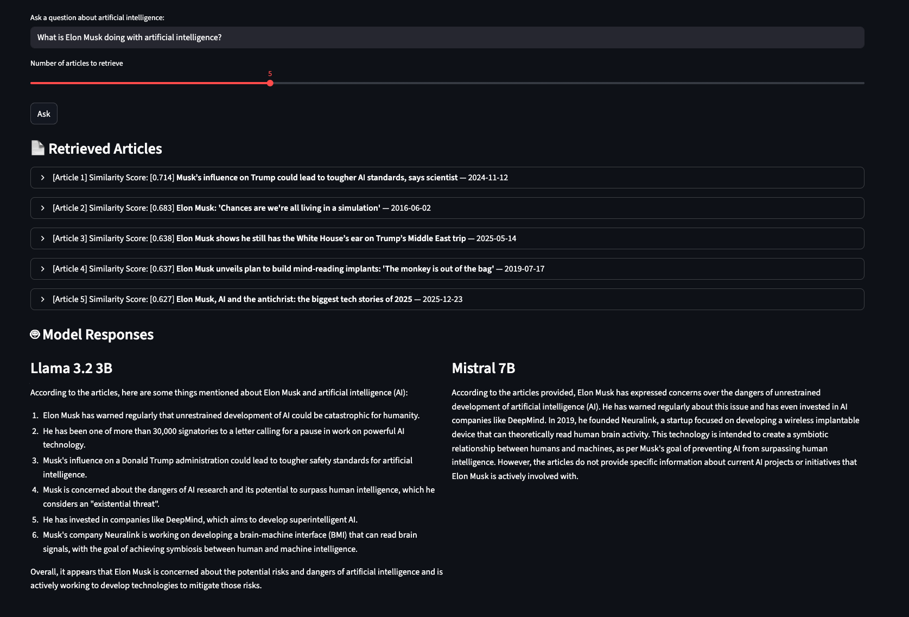

# RAGuardian News Explorer

Although keyword search is a standard approach to querying a collection of text documents, this method of search is a fundamentally limited method for identifying documents within a corpus as it relies on uniformity between a searcher's input word and the document's title or metadata. This project addresses the limitations of conventional keyword searches by leveraging three approaches from the field of natural language processing to better support users in retrieving information from a set of documents that is large enough to make manual review impractical. The corpus used for this prototype includes articles from *The Guardian* (a British daily newspaper) published between 4/4/2016-4/4/2026 that mention artificial intelligence.

The three text processing and analytical methods used in this project enable:
1. **Topic Modeling -> Topic Search** - Users can select from a drop-down list of pre-determined topics within the corpus to find related articles. 
2. **Named Entity Recognition -> Entity Search** - Users can submit a name (such as a person, place, or organization) and the platform will return related articles and entities. 
3. **Retrieval Augmented Generation -> Question & Answer** - Users can submit a question using natural language and the platform will find relevant articles and generate a response using locally-hosted open source large language models (LLMs). 

Instructions for Deployment Coming Soon!